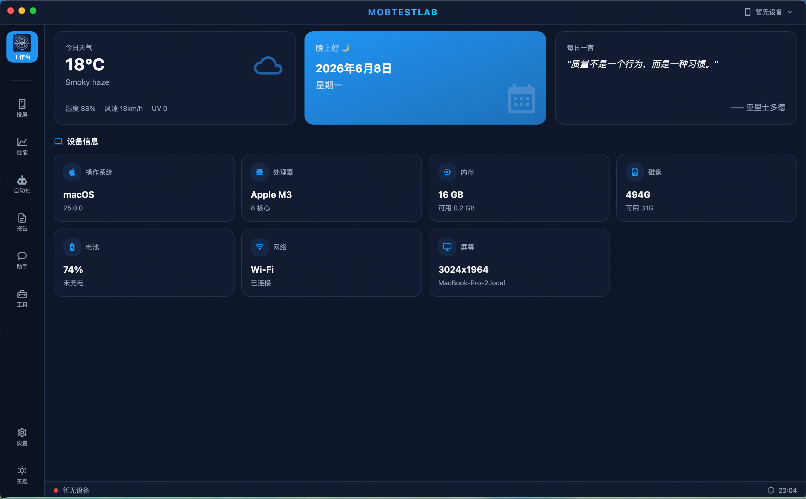
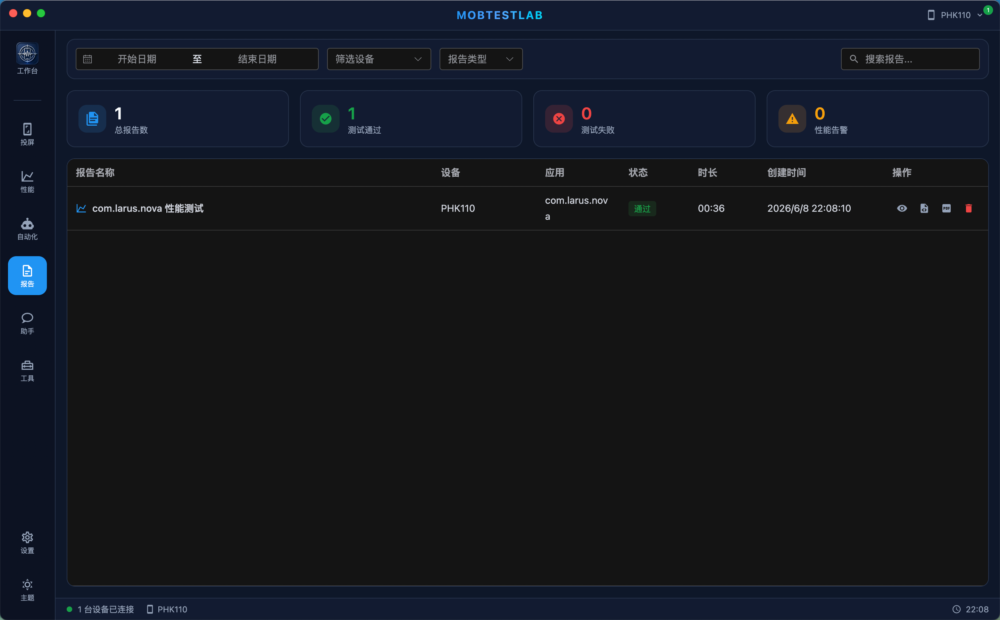
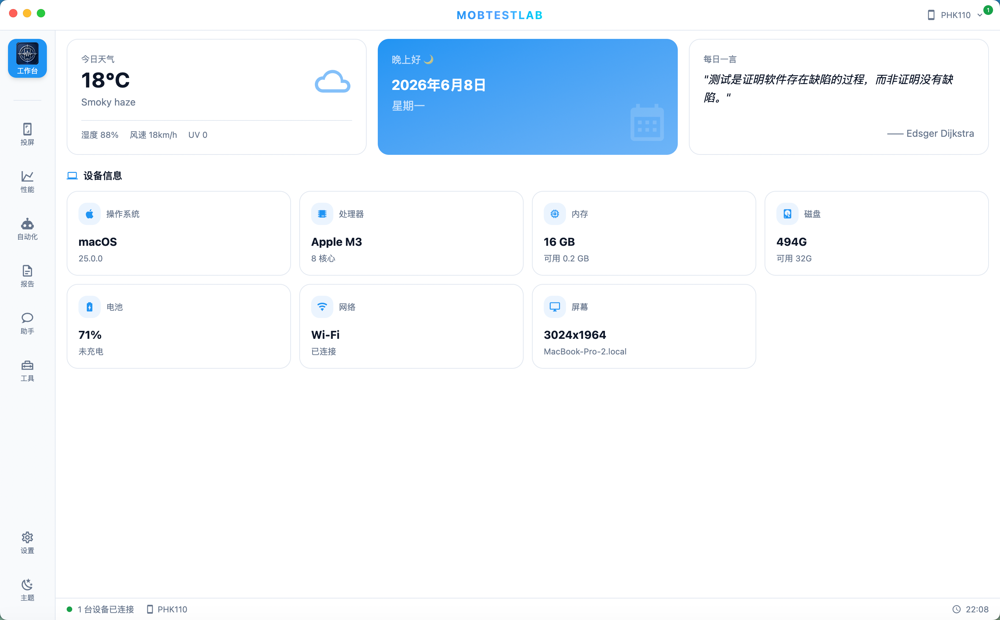

# MobTestLab

一站式移动端测试工作台，基于 Electron + Vue 3 构建的桌面应用，集成投屏控制、性能采集、速度评测、AI 自动化测试、UI 模型自动化和智能助手等核心能力。

## 应用截图

| 工作台 | 投屏 |
|:---:|:---:|
|  |  |

| 性能 | 报告 |
|:---:|:---:|
|  |  |

| 日间模式 |
|:---:|
|  |

## 功能特性

### 投屏控制
- 支持 Android（Scrcpy）、iOS（libimobiledevice）设备实时投屏
- 支持触控操作转发（点击、滑动、滚动）
- 支持键盘输入和文本注入
- 可调节分辨率、帧率、码率

### 性能采集
- 实时采集 CPU、内存、FPS、网络、电量、温度、GPU 等指标
- 异步采集架构，不阻塞 UI
- 实时图表可视化（ECharts）
- 数据导出

### AI 自动化
- 集成 [Midscene.js](https://midscenejs.com/) Android 自动化能力
- 自然语言驱动的 UI 操作（`aiAct`、`aiAssert`、`aiQuery`、`aiWaitFor`）
- 脚本管理（新建、编辑、重命名、复制、删除）
- 实时执行日志和步骤状态
- Midscene HTML 测试报告查看
- 支持自定义 AI 模型配置（OpenAI、Qwen-VL、Gemini 等）

### UI 模型自动化
- 自动化 Tab 支持两种脚本编写方式：GUI Agent 和 UI 模型
- UI 模型方案参考 Airtest IDE，支持设备截图、控件树采集和可视化点选
- 支持图像模板、Poco 选择器、坐标三种定位方式
- 支持点击、输入、滑动、等待、断言、截图等常见自动化动作
- 支持生成 Airtest / Poco Python 脚本，不保留 Appium 格式
- 内置 Python Airtest runner，首次运行会创建 `~/.mobtestlab/airtest-venv` 并安装 `airtest`、`pocoui`
- UI 模型脚本与 GUI Agent 脚本统一管理，可被速度评测任务选择复用

### 速度评测
- 支持从自动化 Tab 新建或选择自动化脚本
- 支持将自动化脚本关联到速度评测任务
- 统一复用自动化脚本资产，减少速度 Tab 内重复维护脚本

### 测试报告
- 自动化测试报告自动归档
- 性能测试报告汇总
- 支持查看 Midscene 原始 HTML 报告
- 报告筛选、搜索、导出

### AI 助手
- 对话式交互界面
- 支持文本、图片、文件等多模态消息
- 对话历史管理（新建、切换、重命名、删除）

## 技术栈

| 分类 | 技术 |
|------|------|
| 框架 | Electron 33 + Vue 3.5 + TypeScript |
| 状态管理 | Pinia |
| UI 组件 | Element Plus + Tailwind CSS 4 |
| 图表 | ECharts (vue-echarts) |
| 图标 | @iconify/vue (MDI) |
| 自动化 | @midscene/android + Airtest + Poco |
| 投屏 | Scrcpy + libimobiledevice |
| 构建 | Vite 6 + electron-builder |

## 快速开始

### 环境要求
- Node.js >= 18
- macOS x64
- ADB（Android 投屏/自动化）
- libimobiledevice（iOS 投屏，可选）
- Python 3（UI 模型 Airtest 执行会自动创建独立 venv）
- 网络可访问 PyPI（首次安装 Airtest / Poco 依赖时需要）

### 安装依赖

```bash
npm install
```

### 开发模式

```bash
npm run electron:dev
```

### 构建

```bash
npm run electron:build
```

产物输出在 `release/` 目录。当前默认构建 macOS x64 包：

```text
release/MobTestLab-2.0.2-mac-x64.dmg
```

构建配置会将 `dist/`、`electron/`、`package.json`、`node_modules/` 和 `resources/bin/` 一起打入应用包。

### UI 模型测试

```bash
npm run test:ui-model
```

该命令会覆盖 UI 模型脚本生成、Airtest runner 注入逻辑和控件树解析逻辑。

## 项目结构

```
├── electron/              # Electron 主进程
│   ├── main.cjs           # 主进程入口
│   ├── preload.cjs        # 预加载脚本（IPC 桥接）
│   ├── scrcpy-client.cjs  # Android 投屏客户端
│   ├── ios-mirror-client.cjs  # iOS 投屏客户端
│   ├── android-perf-collector.cjs  # 性能采集器
│   ├── automation-runner.cjs  # 自动化脚本管理器
│   ├── automation-worker.cjs  # GUI Agent 自动化执行子进程
│   ├── airtest-runner.cjs     # Airtest / Poco Python 执行器
│   └── ui-model-service.cjs   # 设备截图和控件树采集服务
├── src/                   # 渲染进程（Vue）
│   ├── views/             # 页面视图
│   ├── stores/            # Pinia 状态
│   ├── utils/             # UI 模型脚本生成等工具
│   ├── components/        # 通用组件
│   ├── layouts/           # 布局组件
│   └── styles/            # 全局样式
├── resources/bin/         # 内置二进制工具（adb, scrcpy-server, ffmpeg）
├── tests/                 # Node 测试
└── build/                 # 应用图标等构建资源
```

## 更新日志

| 版本 | 日期 | 更新内容 |
|------|------|----------|
| v2.0.3 | 2026-06-11 | 自动化 Tab 新增 UI 模型方案，接入 Airtest / Poco 脚本生成、设备截图与控件树采集、Python Airtest runner；速度评测复用自动化脚本；macOS x64 打包包含运行依赖 |
| v2.0.0 | 2026-06-08 | 新增安装应用工具、GitHub Actions 自动打包（macOS + Windows）、应用图标更新 |
| v1.2.0 | 2026-06-07 | 新增工具 Tab（二维码生成）、工作台仪表盘、Mac 设备信息、自定义菜单栏、助手聊天 UI 重构 |
| v1.0.0 | 2026-06-07 | 初始版本：投屏控制、性能采集、AI 自动化、测试报告、AI 助手 |

## License

MIT
