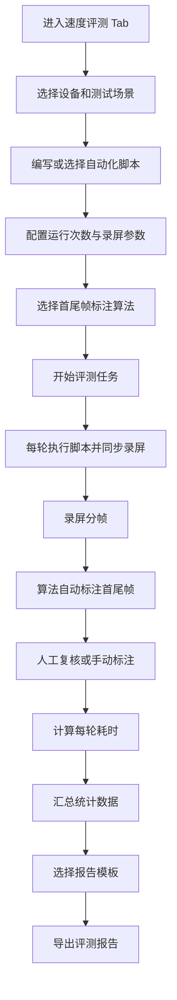
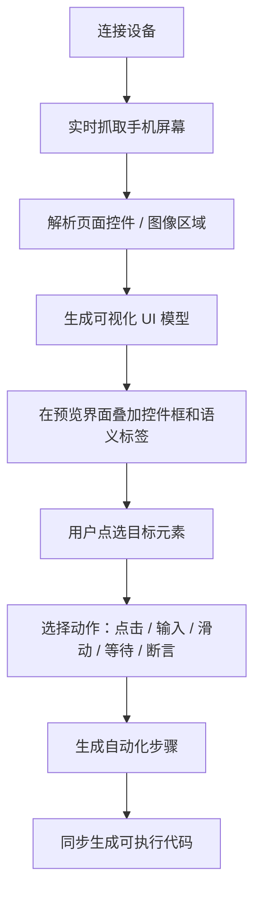
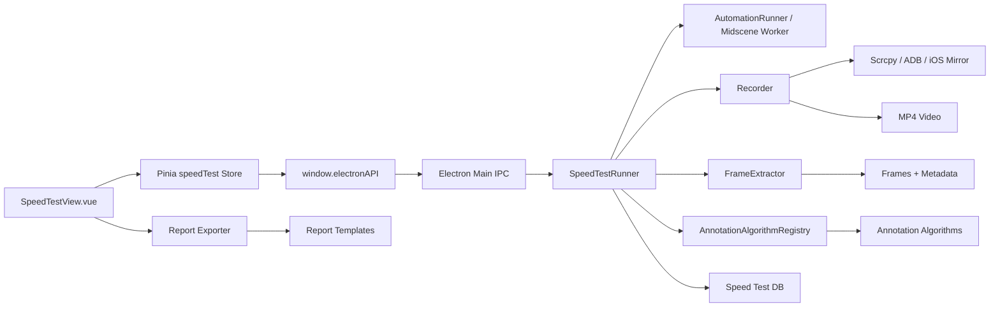

# MobTestLab 速度评测能力方案设计

> 版本：v0.1  
> 日期：2026-06-10  
> 目标：新增「速度评测」功能 Tab，面向 APP 冷启动、页面打开、关键链路响应等速度类测试场景，提供自动化执行、录屏采集、首尾帧标注、耗时统计和定制化报告导出能力。

---

## 1. 背景与目标

### 1.1 典型场景

速度评测能力主要服务以下测试场景：

| 场景 | 示例 | 首帧定义 | 尾帧定义 |
|------|------|----------|----------|
| APP 冷启动 | 点击桌面图标启动 APP | 点击动作发生后的第一帧或启动触发帧 | 首页核心内容稳定可见 |
| APP 热启动 | 后台恢复 APP | 恢复动作触发帧 | 页面恢复到可交互状态 |
| 页面打开 | 点击入口进入详情页 | 点击入口后第一帧 | 详情页主内容完全渲染 |
| 搜索响应 | 输入关键词并点击搜索 | 点击搜索按钮帧 | 搜索结果列表稳定出现 |
| 支付/下单链路 | 点击提交订单 | 提交动作帧 | 结果页或成功弹窗出现 |

### 1.2 建设目标

- 支持编写自动化脚本并设置运行次数，批量执行速度类测试。
- 在脚本运行过程中同步录屏，并支持录屏分辨率、帧率、码率等参数配置。
- 对录屏进行分帧，支持人工标注和算法标注首尾帧。
- 标注算法可在运行开始前选择，并支持后续灵活扩展。
- 自动计算每次运行的首尾帧耗时，并汇总均值、P50、P90、P95、最小值、最大值、标准差等指标。
- 支持一键导出评测报告，报告模板可选择，并为后续自定义模板预留接口。

### 1.3 非目标

- 不在首期实现云端设备农场或分布式并发调度。
- 不在首期实现复杂视频 AI 模型训练平台。
- 不替代现有「性能」Tab 的 CPU、内存、FPS 长时间监控能力，而是与其互补。

---

## 2. 用户流程

### 2.1 主流程



### 2.2 单次运行生命周期

| 阶段 | 输入 | 输出 | 说明 |
|------|------|------|------|
| 准备 | 设备、脚本、录屏参数、算法配置 | run 记录 | 初始化运行上下文 |
| 开始录屏 | deviceId、分辨率、帧率、码率 | video 文件 | 录屏应早于脚本动作启动 |
| 执行脚本 | 自动化脚本 | step logs | 可复用 Midscene 自动化执行能力 |
| 停止录屏 | runId | 完整录屏文件 | 脚本结束后延迟 N ms 停止，避免尾帧缺失 |
| 分帧 | video 文件、采样策略 | frame 列表 | 记录帧序号、时间戳、缩略图 |
| 标注 | frame 列表、算法配置 | startFrame、endFrame | 支持算法标注和人工覆盖 |
| 计算 | 首尾帧时间戳 | durationMs | durationMs = endFrame.timeMs - startFrame.timeMs |

---

## 3. 功能设计

### 3.1 新增功能入口

新增一级导航 Tab：

- 名称：速度评测
- 路由：`/speed-test`
- 建议图标：`mdi:speedometer`
- 页面文件：`src/views/SpeedTestView.vue`
- 状态管理：`src/stores/speedTest.ts`

页面建议采用四区布局：

| 区域 | 内容 |
|------|------|
| 左侧任务列表 | 速度评测任务、历史任务、状态筛选 |
| 顶部配置栏 | 设备、场景类型、运行次数、录屏参数、算法、报告模板 |
| 中部工作区 | 自动化脚本编辑器、运行进度、每轮结果表 |
| 右侧/下方标注区 | 视频帧时间轴、首帧/尾帧标注、算法建议、人工修正 |

### 3.2 自动化脚本能力

速度评测中的“编写自动化脚本”必须与现有「自动化」Tab 打通，不单独建设一套孤立脚本体系。自动化 Tab 需要同时支持两种脚本生产方式：

| 方式 | 名称 | 用户体验 | 产物 | 适用人群 |
|------|------|----------|------|----------|
| 方式一 | 可视化 UI 模型点选生成代码 | 实时抓取手机屏幕，解析页面控件和图像，用户在预览界面点选目标元素，工具自动生成点击、输入、滑动等代码 | 结构化自动化步骤 + 可执行脚本 | 不想手写定位器的测试/开发 |
| 方式二 | GUI Agent 自然语言自动化 | 用户用自然语言描述操作和断言，由已实现的 GUI Agent / Midscene 能力执行 | `agent.aiAct` / `agent.aiAssert` / `agent.aiQuery` / `agent.aiWaitFor` 脚本 | 快速探索、语义化任务、复杂页面 |

速度评测 Tab 不关心脚本具体来源，只消费统一的脚本资产：

```ts
interface AutomationScriptAsset {
  id: string
  name: string
  source: 'visual_model' | 'gui_agent' | 'mixed'
  content: string
  steps: AutomationStep[]
  createdAt: string
  updatedAt: string
}
```

#### 3.2.1 可视化 UI 模型点选生成代码

自动化 Tab 增强一个“屏幕建模”模式：



页面解析能力分层设计：

| 层级 | 数据来源 | 能力 | 说明 |
|------|----------|------|------|
| 设备控件树 | Android uiautomator dump / iOS WDA source / HarmonyOS uitest | 获取文本、类型、bounds、可点击状态 | 首选，结构化程度最高 |
| 图像检测 | 截图 + 图像分割 / OCR / 模板识别 | 识别图片按钮、图标、非原生控件 | 兜底 WebView、游戏、Canvas 等场景 |
| GUI Agent 语义理解 | 视觉模型理解当前截图 | 生成语义目标和操作建议 | 用于控件树不可用或语义不足时 |

统一 UI 模型：

```ts
interface VisualUiNode {
  id: string
  source: 'accessibility' | 'ocr' | 'vision' | 'template'
  type: 'button' | 'input' | 'text' | 'image' | 'list' | 'unknown'
  label?: string
  text?: string
  bounds: { x: number; y: number; width: number; height: number }
  clickable: boolean
  editable: boolean
  confidence: number
  screenshotPath?: string
}
```

点选后的动作模型：

```ts
type AutomationActionType = 'tap' | 'input' | 'swipe' | 'waitFor' | 'assertVisible'

interface AutomationStep {
  id: string
  action: AutomationActionType
  target?: VisualUiNode
  value?: string
  description: string
  code: string
}
```

代码生成原则：

- 不要求用户手写定位器、XPath、控件 ID。
- 生成代码优先使用语义描述和稳定控件特征。
- 坐标只作为兜底信息保存，避免设备分辨率变化导致脚本失效。
- 每一步保留 `target snapshot`，便于后续回放、修复和审计。

示例生成代码：

```js
await agent.aiAct('点击文本为“登录”的按钮')
await agent.aiAct('在手机号输入框中输入 13800138000')
await agent.aiAct('向上滑动列表，直到看到“提交订单”')
await agent.aiAssert('页面上显示“提交订单”按钮')
```

如果底层执行器后续支持结构化动作，也可以生成更确定性的 DSL：

```js
await agent.tap({ text: '登录', role: 'button' })
await agent.input({ placeholder: '手机号' }, '13800138000')
await agent.swipe({ direction: 'up', distance: 0.6 })
await agent.assertVisible({ text: '提交订单' })
```

首期建议生成 Midscene 兼容的自然语言代码，保留结构化 `steps`，后续再逐步引入确定性 DSL 执行器。

#### 3.2.2 GUI Agent 自然语言自动化

现有 GUI Agent 方式继续保留，并作为速度评测首期最快可用路径：

```js
// 冷启动测试示例
await agent.aiAct('回到桌面')
await agent.aiAct('点击 MobTestLab Demo 应用图标')
await agent.aiWaitFor('首页核心内容已经展示')
```

GUI Agent 模式适合：

- 快速创建探索性自动化脚本。
- 页面控件树不稳定或不可见的场景。
- 需要结合视觉理解完成的复杂任务。
- 需要用自然语言表达断言和等待条件的场景。

#### 3.2.3 速度评测运行上下文

在复用自动化 Tab 脚本资产的基础上，速度评测为脚本增加运行上下文：

```ts
interface SpeedTestScriptContext {
  runIndex: number
  totalRuns: number
  deviceId: string
  mark: (name: string) => void
}
```

速度评测编排器负责：

- 从自动化 Tab 选择已有脚本，或跳转到自动化 Tab 创建脚本。
- 支持导入 `visual_model`、`gui_agent`、`mixed` 三类脚本。
- 脚本仍由 Midscene worker 或统一自动化执行器执行。
- 速度评测任务编排器负责在每轮脚本前后启动/停止录屏。
- 后续可扩展 `mark('start')`、`mark('end')` 这样的脚本内软标记，用于辅助算法定位。

### 3.3 运行次数与任务控制

配置项：

| 配置 | 类型 | 默认值 | 说明 |
|------|------|--------|------|
| `iterations` | number | 5 | 脚本运行次数 |
| `warmupRuns` | number | 0 | 预热次数，不计入报告 |
| `runIntervalMs` | number | 3000 | 每轮之间等待时间 |
| `stopDelayMs` | number | 1000 | 脚本结束后延迟停止录屏 |
| `failurePolicy` | enum | continue | 单轮失败后继续或中断 |

任务状态：

```ts
type SpeedTestTaskStatus =
  | 'draft'
  | 'running'
  | 'paused'
  | 'annotating'
  | 'completed'
  | 'failed'
  | 'cancelled'
```

### 3.4 录屏采集

#### Android

推荐首期方案：

- 使用现有 scrcpy 投屏能力采集视频流，或使用 `adb shell screenrecord` 作为兜底。
- 若要支持更稳定的分辨率、帧率、码率配置，优先复用 `ScrcpyClient` 的视频流，并在主进程侧通过 ffmpeg 写入 MP4。

备选方案对比：

| 方案 | 优点 | 缺点 | 建议 |
|------|------|------|------|
| scrcpy 视频流 + ffmpeg | 与现有投屏能力一致，可控参数多，可支持边录边预览 | 需要主进程实现录制管线 | 推荐 |
| `adb shell screenrecord` | 实现简单，Android 原生 | 参数和时长受限，拉取文件慢，部分设备兼容性一般 | 兜底 |
| Renderer MediaRecorder canvas | 前端实现快 | 受渲染帧率影响，时间戳精度较弱 | 仅用于预览或临时方案 |

录屏参数：

| 参数 | 可选值 | 默认值 |
|------|--------|--------|
| 分辨率 | 原始、1080p、720p、480p | 720p |
| 帧率 | 60、30、15 | 30 |
| 码率 | 4Mbps、8Mbps、12Mbps、20Mbps | 8Mbps |
| 编码 | H.264 | H.264 |
| 输出格式 | MP4 | MP4 |

#### iOS / HarmonyOS

首期可预留接口，优先完成 Android：

- iOS：复用 `IosMirrorClient` 的帧流或后续接入 `xcrun simctl io` / QuickTime 方案。
- HarmonyOS：复用 HDC 截屏/录屏能力或后续接入平台录屏命令。

### 3.5 分帧能力

录屏完成后由主进程使用 ffmpeg 进行分帧：

```bash
ffmpeg -i input.mp4 -vf fps=30 frames/%06d.jpg
```

需要同时生成帧元数据：

```ts
interface SpeedFrame {
  id: string
  runId: string
  index: number
  timeMs: number
  imagePath: string
  thumbnailPath: string
  width: number
  height: number
  hash?: string
}
```

时间戳计算策略：

- 固定帧率录制：`timeMs = index * 1000 / fps`
- 可变帧率录制：优先用 `ffprobe` 读取每帧 `best_effort_timestamp_time`

首期建议采用固定帧率录制，降低实现复杂度；同时在元数据结构中保留真实时间戳字段。

### 3.6 首尾帧标注

#### 标注模式

| 模式 | 说明 | 适用场景 |
|------|------|----------|
| 人工标注 | 用户在帧时间轴上手动选择首帧、尾帧 | 所有场景兜底 |
| 算法标注 | 算法自动给出首尾帧和置信度 | 批量运行提效 |
| 算法建议 + 人工复核 | 算法先标注，用户可修正 | 首期推荐默认模式 |

#### 人工标注交互

标注区建议能力：

- 视频/帧时间轴浏览。
- 左右方向键逐帧移动。
- `S` 设置首帧，`E` 设置尾帧。
- 展示当前帧序号、时间戳、缩略图。
- 展示算法建议帧和置信度。
- 人工覆盖后保留算法结果，便于后续算法效果分析。

#### 算法标注扩展机制

定义统一算法接口：

```ts
interface FrameAnnotationAlgorithm {
  id: string
  name: string
  version: string
  description: string
  configSchema: Record<string, unknown>
  annotate(input: AnnotationInput): Promise<AnnotationResult>
}

interface AnnotationInput {
  taskId: string
  runId: string
  frames: SpeedFrame[]
  videoPath: string
  scenario: 'cold_start' | 'hot_start' | 'page_open' | 'custom'
  config: Record<string, unknown>
}

interface AnnotationResult {
  startFrameIndex?: number
  endFrameIndex?: number
  confidence: number
  reason?: string
  debugArtifacts?: string[]
}
```

算法注册中心：

```ts
class AnnotationAlgorithmRegistry {
  register(algorithm: FrameAnnotationAlgorithm): void
  get(id: string): FrameAnnotationAlgorithm | undefined
  list(): FrameAnnotationAlgorithmMeta[]
}
```

建议目录：

```text
electron/
  speed-test/
    recorder.cjs
    frame-extractor.cjs
    annotation-registry.cjs
    algorithms/
      visual-diff.cjs
      template-match.cjs
      ocr-keyword.cjs
      stable-frame.cjs
```

首期内置算法建议：

| 算法 | ID | 原理 | 适用场景 |
|------|----|------|----------|
| 视觉差分 | `visual-diff` | 计算相邻帧像素差异，找出动作开始和画面稳定点 | 冷启动、页面跳转 |
| 模板匹配 | `template-match` | 用户提供目标截图模板，匹配目标元素首次出现帧 | 固定页面目标 |
| 稳定帧检测 | `stable-frame` | 连续 N 帧差异低于阈值判定结束 | 页面加载完成 |
| OCR 关键词 | `ocr-keyword` | 识别目标文本首次出现帧 | 搜索结果、成功页 |

首期落地优先级：

1. `visual-diff + stable-frame`：不依赖额外模型，工程成本最低。
2. `template-match`：需要用户选择目标区域或上传模板。
3. `ocr-keyword`：后续接入 OCR 引擎后实现。

### 3.7 耗时计算与统计

单轮结果：

```ts
interface SpeedTestRunResult {
  id: string
  taskId: string
  index: number
  status: 'pending' | 'running' | 'recorded' | 'annotated' | 'failed'
  videoPath: string
  frameDir: string
  startFrameIndex?: number
  endFrameIndex?: number
  startTimeMs?: number
  endTimeMs?: number
  durationMs?: number
  annotationMode?: 'manual' | 'algorithm' | 'mixed'
  algorithmId?: string
  confidence?: number
  error?: string
}
```

汇总指标：

| 指标 | 说明 |
|------|------|
| avg | 平均耗时 |
| median / P50 | 中位数 |
| P90 / P95 | 长尾耗时 |
| min / max | 最小/最大耗时 |
| stddev | 波动情况 |
| successRate | 有效运行占比 |

异常处理：

- 未找到首帧或尾帧：该轮标记为 `needs_manual_annotation`。
- 尾帧早于首帧：禁止保存，并提示重新标注。
- 脚本失败：保留录屏和日志，可选择纳入失败统计但不参与耗时均值。

### 3.8 报告导出与模板

报告内容：

- 基本信息：任务名称、设备、系统版本、APP、场景、脚本、运行次数、录屏参数、标注算法。
- 汇总结论：平均耗时、P50、P90、P95、成功率、波动情况。
- 单轮明细：运行序号、首帧、尾帧、耗时、标注方式、置信度、状态。
- 可视化：耗时柱状图、趋势折线图、分布图。
- 证据材料：每轮首尾帧缩略图、录屏文件链接或路径、算法 debug 信息。

报告格式：

| 格式 | 首期建议 | 说明 |
|------|----------|------|
| HTML | 必做 | 易于定制模板、可内嵌图片和图表 |
| PDF | 可选 | 通过打印或后续 Puppeteer 生成 |
| JSON | 建议 | 方便 CI 或二次分析 |
| CSV | 建议 | 方便表格分析 |

模板机制：

```text
resources/report-templates/speed-test/
  default/
    template.html
    style.css
    manifest.json
  compact/
    template.html
    style.css
    manifest.json
```

模板描述：

```json
{
  "id": "default",
  "name": "默认速度评测报告",
  "version": "1.0.0",
  "format": "html",
  "description": "包含汇总、趋势图、单轮明细和首尾帧证据"
}
```

渲染方式：

- 主进程读取模板。
- 注入结构化 JSON 数据。
- 首期可使用轻量模板替换，例如 `{{task.name}}`、`{{summary.avg}}`。
- 后续如模板复杂度提升，可引入 Handlebars 或 EJS。

---

## 4. 技术架构设计

### 4.1 总体架构



### 4.2 主进程新增模块

```text
electron/
  automation/
    screen-analyzer.cjs          # 自动化 Tab 屏幕抓取与 UI 模型解析
    ui-model-generator.cjs       # 控件树、OCR、视觉结果合并
    code-generator.cjs           # 根据点选动作生成自动化代码
  speed-test/
    speed-test-runner.cjs       # 任务编排
    recorder.cjs                # 录屏抽象
    frame-extractor.cjs         # ffmpeg/ffprobe 分帧
    annotation-registry.cjs     # 算法注册中心
    report-exporter.cjs         # 报告导出
    algorithms/
      visual-diff.cjs
      stable-frame.cjs
      template-match.cjs
```

模块职责：

| 模块 | 职责 |
|------|------|
| `screen-analyzer` | 实时截图、抓取控件树、生成页面候选元素 |
| `ui-model-generator` | 合并 accessibility、OCR、视觉模型、模板识别结果 |
| `code-generator` | 将用户点选和动作配置转换为可执行自动化代码 |
| `speed-test-runner` | 管理任务生命周期、循环运行、事件推送 |
| `recorder` | 按设备平台启动/停止录屏，输出视频 |
| `frame-extractor` | 分帧、缩略图、元数据生成 |
| `annotation-registry` | 管理算法列表、算法配置、执行算法 |
| `report-exporter` | 根据模板导出 HTML/PDF/JSON/CSV |

### 4.3 IPC 设计

建议新增 API：

```js
// Speed test task
createSpeedTestTask(config)
updateSpeedTestTask(taskId, patch)
deleteSpeedTestTask(taskId)
getSpeedTestTasks()
getSpeedTestTask(taskId)

// Execution
startSpeedTest(taskId)
pauseSpeedTest(taskId)
stopSpeedTest(taskId)
rerunSpeedTestRun(taskId, runId)
onSpeedTestEvent(callback)
offSpeedTestEvent()

// Annotation
getAnnotationAlgorithms()
runAnnotation(taskId, runId, algorithmId, config)
saveFrameAnnotation(taskId, runId, annotation)
getFrames(taskId, runId)

// Report
getSpeedReportTemplates()
exportSpeedReport(taskId, options)
```

事件类型：

```ts
type SpeedTestEvent =
  | { type: 'task-started'; taskId: string }
  | { type: 'run-started'; taskId: string; runId: string; index: number }
  | { type: 'recording-started'; taskId: string; runId: string }
  | { type: 'script-log'; taskId: string; runId: string; message: string; status: string }
  | { type: 'recording-stopped'; taskId: string; runId: string; videoPath: string }
  | { type: 'frames-extracted'; taskId: string; runId: string; count: number }
  | { type: 'annotation-suggested'; taskId: string; runId: string; result: AnnotationResult }
  | { type: 'run-completed'; taskId: string; runId: string; durationMs?: number }
  | { type: 'task-completed'; taskId: string }
  | { type: 'error'; taskId: string; runId?: string; message: string }
```

---

## 5. 数据存储设计

当前项目使用 `sql.js` 保存报告数据。速度评测建议扩展独立表，继续落到 `~/.mobtestlab/reports.db`，同时大文件放在文件系统。

### 5.1 文件目录

```text
~/.mobtestlab/
  speed-tests/
    {taskId}/
      task.json
      runs/
        {runId}/
          recording.mp4
          frames/
            000001.jpg
            000002.jpg
          thumbs/
            000001.jpg
          frames.json
          annotation.json
          logs.json
      reports/
        report.html
        report.json
        report.csv
```

### 5.2 数据表

```sql
CREATE TABLE IF NOT EXISTS speed_test_tasks (
  id TEXT PRIMARY KEY,
  name TEXT,
  scenario TEXT,
  deviceId TEXT,
  deviceName TEXT,
  appPackage TEXT,
  script TEXT,
  config TEXT,
  status TEXT,
  createdAt TEXT,
  updatedAt TEXT,
  completedAt TEXT
);

CREATE TABLE IF NOT EXISTS speed_test_runs (
  id TEXT PRIMARY KEY,
  taskId TEXT,
  runIndex INTEGER,
  status TEXT,
  videoPath TEXT,
  frameDir TEXT,
  annotation TEXT,
  durationMs INTEGER,
  error TEXT,
  createdAt TEXT,
  completedAt TEXT
);
```

`config` 示例：

```json
{
  "iterations": 5,
  "warmupRuns": 0,
  "runIntervalMs": 3000,
  "stopDelayMs": 1000,
  "recording": {
    "resolution": "720p",
    "fps": 30,
    "bitrate": 8000000,
    "format": "mp4"
  },
  "annotation": {
    "algorithmId": "visual-diff",
    "mode": "algorithm_then_manual",
    "config": {
      "diffThreshold": 0.08,
      "stableFrameCount": 5
    }
  },
  "reportTemplateId": "default"
}
```

---

## 6. 页面交互设计

### 6.1 配置态

用户进入速度评测 Tab 后：

- 选择设备。
- 填写任务名称。
- 选择场景类型：冷启动、热启动、页面打开、自定义。
- 编辑自动化脚本。
- 设置运行次数、预热次数、间隔时间。
- 设置录屏参数。
- 选择标注算法和算法配置。
- 选择报告模板。

### 6.2 运行态

展示：

- 总进度：第 N / M 轮。
- 当前阶段：录屏中、脚本执行中、分帧中、标注中。
- 脚本日志。
- 每轮结果表。
- 失败轮次可重跑。

### 6.3 标注态

每轮结果进入标注态后：

- 左侧显示帧时间轴。
- 中间显示当前帧大图。
- 右侧显示首帧、尾帧、耗时、算法置信度。
- 支持手动选择首帧/尾帧并保存。
- 支持重新运行算法。
- 支持批量接受算法标注。

### 6.4 报告态

所有有效轮次标注完成后：

- 展示汇总统计。
- 展示趋势图和明细表。
- 选择报告模板。
- 一键导出 HTML/JSON/CSV。
- 可选择是否复制视频和帧证据到报告目录。

---

## 7. 分阶段实施计划

### Phase 1：端到端最小闭环

目标：完成 Android 冷启动速度评测闭环。

- 自动化 Tab 复用现有 GUI Agent 脚本能力，作为速度评测首期脚本来源。
- 新增速度评测 Tab 和路由。
- 新增任务配置 UI：设备、自动化脚本、运行次数、录屏参数。
- 新增主进程 `speed-test-runner`。
- 复用 Midscene 自动化脚本执行。
- 实现录屏启动/停止。
- 使用 ffmpeg 分帧。
- 实现人工首尾帧标注。
- 计算单轮耗时和汇总统计。
- 导出默认 HTML/JSON 报告。

### Phase 2：算法标注与批量提效

目标：减少人工标注成本。

- 自动化 Tab 新增屏幕抓取和 UI 模型预览。
- 支持基于控件树和截图解析页面控件、文本、图像区域。
- 支持在预览界面点选元素并生成点击、输入、滑动、等待、断言代码。
- 支持将可视化生成的脚本保存为速度评测可复用脚本资产。
- 实现算法注册中心。
- 内置 `visual-diff` 和 `stable-frame`。
- 运行前支持选择算法和参数。
- 每轮录屏后自动算法标注。
- 支持批量接受算法结果。
- 保存算法置信度和 debug 信息。

### Phase 3：模板化报告与高级评测

目标：完善报告表达和可扩展能力。

- 支持多报告模板选择。
- 支持自定义模板目录。
- 支持 HTML/PDF/CSV 导出。
- 支持模板匹配算法。
- 支持基于脚本 `mark()` 的辅助标注。
- 支持任务复制、历史对比、基线阈值。

### Phase 4：多平台与 CI 能力

目标：扩展到 iOS/HarmonyOS 和自动化流水线。

- iOS 录屏管线接入。
- HarmonyOS 录屏管线接入。
- CLI 或 headless 评测入口。
- JSON 报告适配 CI 门禁。
- 支持基线对比和超阈值失败。

---

## 8. 风险与注意事项

| 风险 | 影响 | 应对 |
|------|------|------|
| 录屏时间戳不准 | 耗时误差 | 固定帧率录制，优先使用 ffprobe 真实时间戳 |
| 脚本动作与录屏起点不同步 | 首帧偏移 | 录屏先启动，脚本后启动；支持脚本 mark 辅助定位 |
| 算法误判 | 批量数据不可信 | 默认算法建议 + 人工复核；保存置信度 |
| 视频和帧文件占用空间大 | 用户目录膨胀 | 提供任务清理、保留策略、缩略图缓存 |
| 多平台录屏差异大 | 实现复杂 | 首期聚焦 Android，接口层预留 platform adapter |
| ffmpeg 路径依赖 | 开发/打包不一致 | 统一通过 `getBinPath('ffmpeg')` 获取 |
| Midscene 脚本失败 | 任务中断 | 支持失败策略和单轮重跑 |

---

## 9. 与现有项目的衔接点

| 现有能力 | 复用方式 |
|----------|----------|
| 设备管理 | 复用 `get-devices` 和 `useDeviceStore` |
| 自动化执行 | 复用 `AutomationRunner` / `automation-worker.cjs`，后续可抽象公共 runner |
| GUI Agent 自动化 | 复用已实现的 `agent.aiAct`、`agent.aiAssert`、`agent.aiQuery`、`agent.aiWaitFor` 能力 |
| 自动化 Tab 脚本管理 | 速度评测从自动化 Tab 选择脚本资产，避免重复建设脚本系统 |
| 可视化脚本生成 | 自动化 Tab 新增屏幕解析、UI 模型、点选生成代码，速度评测复用其产物 |
| Android 投屏 | 复用 `ScrcpyClient`，扩展录制输出 |
| ffmpeg | 复用 `getBinPath('ffmpeg')` |
| 报告 DB | 扩展 `db.cjs` 表结构，保留现有 reports 表 |
| 报告页面 | 后续可在 `ReportsView` 中增加速度评测报告类型 |
| UI 风格 | 延续现有 Element Plus + Tailwind + Iconify 风格 |

---

## 10. 推荐首期接口草案

### 10.1 preload

```js
// Automation visual model
captureAutomationScreen(deviceId)
getAutomationUiModel(deviceId, options)
generateAutomationCode(steps, options)

// Speed test task
createSpeedTestTask: (config) => ipcRenderer.invoke('speed-test:create-task', config),
getSpeedTestTasks: () => ipcRenderer.invoke('speed-test:get-tasks'),
startSpeedTest: (taskId) => ipcRenderer.invoke('speed-test:start', taskId),
stopSpeedTest: (taskId) => ipcRenderer.invoke('speed-test:stop', taskId),
getSpeedTestFrames: (taskId, runId) => ipcRenderer.invoke('speed-test:get-frames', taskId, runId),
saveSpeedTestAnnotation: (taskId, runId, annotation) =>
  ipcRenderer.invoke('speed-test:save-annotation', taskId, runId, annotation),
getSpeedTestAlgorithms: () => ipcRenderer.invoke('speed-test:get-algorithms'),
exportSpeedTestReport: (taskId, options) =>
  ipcRenderer.invoke('speed-test:export-report', taskId, options),
onSpeedTestEvent: (callback) => ipcRenderer.on('speed-test:event', callback),
offSpeedTestEvent: () => ipcRenderer.removeAllListeners('speed-test:event')
```

### 10.2 renderer store

```ts
export const useSpeedTestStore = defineStore('speedTest', () => {
  const tasks = ref<SpeedTestTask[]>([])
  const currentTask = ref<SpeedTestTask | null>(null)
  const events = ref<SpeedTestEvent[]>([])

  const loadTasks = async () => {}
  const createTask = async (config: SpeedTestTaskConfig) => {}
  const startTask = async (taskId: string) => {}
  const stopTask = async (taskId: string) => {}
  const saveAnnotation = async (taskId: string, runId: string, annotation: FrameAnnotation) => {}
  const exportReport = async (taskId: string, options: ExportOptions) => {}

  return { tasks, currentTask, events, loadTasks, createTask, startTask, stopTask, saveAnnotation, exportReport }
})
```

---

## 11. 验收标准

首期验收建议：

- 可以在速度评测 Tab 创建一个 APP 冷启动任务。
- 可以从自动化 Tab 选择 GUI Agent 方式创建的脚本用于速度评测。
- 可以设置脚本运行次数，例如 5 次。
- 每次运行时能自动录屏，并生成对应 MP4 文件。
- 每个 MP4 可以被分帧，并能在 UI 中浏览帧。
- 用户可以人工标注每轮首帧和尾帧。
- 系统能计算每轮耗时和整体统计数据。
- 可以导出 HTML 和 JSON 报告。
- 任务关闭应用后重新打开，历史任务和标注结果仍然存在。

算法标注验收建议：

- 可以在运行前选择 `visual-diff` 算法。
- 录屏分帧后自动给出首尾帧建议和置信度。
- 用户可以接受或覆盖算法结果。
- 报告中能区分人工标注、算法标注和混合标注。

自动化脚本生成验收建议：

- 自动化 Tab 可以实时抓取手机屏幕并展示预览图。
- 自动化 Tab 可以解析并叠加展示页面控件、文本或图像区域。
- 用户可以在预览界面点选目标元素并选择点击、输入、滑动、等待、断言动作。
- 工具可以自动生成对应自动化代码，不要求用户手写定位器、XPath 或控件 ID。
- 可视化点选生成的脚本和 GUI Agent 自然语言脚本都可以被速度评测任务引用。
